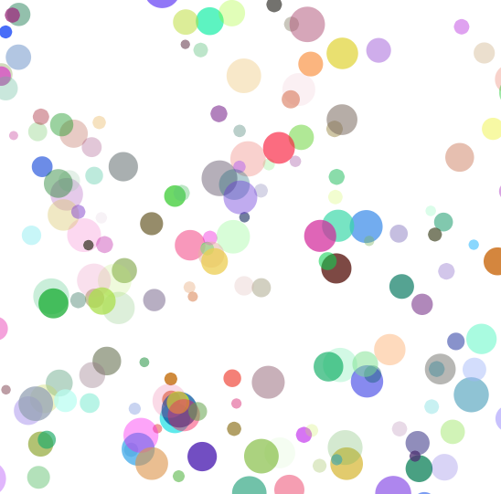

<iframe src="https://openprocessing.org/sketch/1600843/embed/" width="400" height="400"></iframe>

#  About

情報工学を専攻している現役大学院生です！
専門はユビキタスコンピューティング、HCI(Human Computer Intaraction)です。
学業ではPythonを使用した機械学習、プライベートではWeb/Androidアプリ開発、Unity+Blenderを使用したゲーム開発など幅広く活動しています。

#   使用言語
- Python
- R
- Javascript
- HTML
- CSS
- GAS
- C
- json

#  使用可能ツール
- Unity
- Blender
- Adobe Photoshop / Illustrator / PremiaPro
- OpenProcessing
